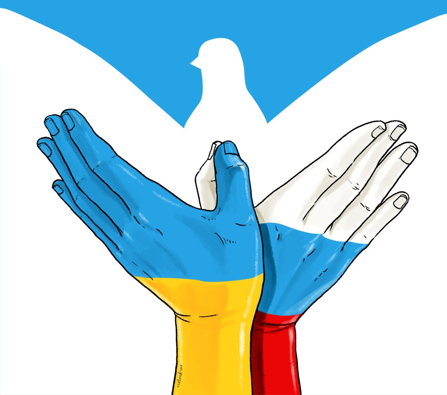

# Roman Morozenko 

## Contacts:
**phone number**: *+7(916)191-58-46*\
**discord**: **RomanMorozenko**\
**e-mail**: romanvm2020@gmail.com
## Skills: 
* HTML
* CSS
* JavaScript
* Git
### English Level: B2

## Education: 

*Courses*:
* FreeCodeCamp Responsive Web Design\
* FreeCodeCamp Javascript Algorithms and Data Structures\
* learn.javascript.ru

**Higher Education** : Bachelor of Management in  MGUTM Moscow, Russia  (*2011-2016*)

## Code sample: 


```
function sumOfDifferences(arr) {

    arr.sort((a,b) => a-b);
    let sum = 0;

    for ( i = arr.length-1; i > 0 ; i-- ) {

          x = arr[i]-arr[i-1]
         sum+=x
    }
return sum 
}
```

## About myself:

I'm a 32 y.o. JavaScript enthusiast. Moving towards my first job as a web developer. 
